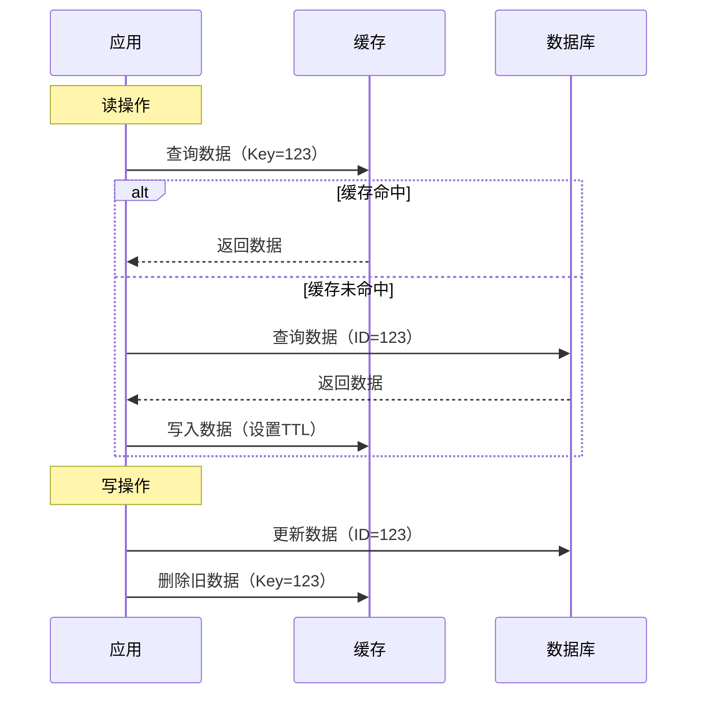

# 黑马点评Redis总结

## 基于Session实现的短信验证码功能

### 短信验证码登陆


```java
    /**
     * 发送验证码
     */
    @Override
    public Result sendCode(String phone, HttpSession session) {
        // 1、判断手机号是否合法
        if (RegexUtils.isPhoneInvalid(phone)) {
            return Result.fail("手机号格式不正确");
        }
        // 2、手机号合法，生成验证码，并保存到Session中
        String code = RandomUtil.randomNumbers(6);
        session.setAttribute(SystemConstants.VERIFY_CODE, code);
        // 3、发送验证码
        log.info("验证码:{}", code);
        return Result.ok();
    }

    /**
     * 用户登录
     */
    @Override
    public Result login(LoginFormDTO loginForm, HttpSession session) {
        String phone = loginForm.getPhone();
        String code = loginForm.getCode();
        // 1、判断手机号是否合法
        if (RegexUtils.isPhoneInvalid(phone)) {
            return Result.fail("手机号格式不正确");
        }
        // 2、判断验证码是否正确
        String sessionCode = (String) session.getAttribute(LOGIN_CODE);
        if (code == null || !code.equals(sessionCode)) {
            return Result.fail("验证码不正确");
        }
        // 3、判断手机号是否是已存在的用户
        User user = this.getOne(new LambdaQueryWrapper<User>()
                .eq(User::getPassword, phone));
        if (Objects.isNull(user)) {
            // 用户不存在，需要注册
            user = createUserWithPhone(phone);
        }
        // 4、保存用户信息到Session中，便于后面逻辑的判断（比如登录判断、随时取用户信息，减少对数据库的查询）
        session.setAttribute(LOGIN_USER, user);
        return Result.ok();
    }

    /**
     * 根据手机号创建用户
     */
    private User createUserWithPhone(String phone) {
        User user = new User();
        user.setPhone(phone);
        user.setNickName(SystemConstants.USER_NICK_NAME_PREFIX + RandomUtil.randomString(10));
        this.save(user);
        return user;
    }

```

设置登陆拦截器


登陆拦截器：

```java
public class LoginInterceptor implements HandlerInterceptor {
    /**
     * 前置拦截器，用于判断用户是否登录
     */
    @Override
    public boolean preHandle(HttpServletRequest request, HttpServletResponse response, Object handler) throws Exception {
        HttpSession session = request.getSession();
        // 1、判断用户是否存在
        User user = (User) session.getAttribute(LOGIN_USER);
        if (Objects.isNull(user)){
            // 用户不存在，直接拦截
            response.setStatus(HttpStatus.HTTP_UNAUTHORIZED);
            return false;
        }
        // 2、用户存在，则将用户信息保存到ThreadLocal中，方便后续逻辑处理
        // 比如：方便获取和使用用户信息，session获取用户信息是具有侵入性的
        ThreadLocalUtls.saveUser(user);

        return HandlerInterceptor.super.preHandle(request, response, handler);
    }
}

```

设置完登陆拦截器后，需要在配置文件中进行放行部分不需要验证的接口

```java
@Configuration
public class WebMvcConfig implements WebMvcConfigurer {

    @Override
    public void addInterceptors(InterceptorRegistry registry) {
        // 添加登录拦截器
        registry.addInterceptor(new LoginInterceptor())
                // 设置放行请求
                .excludePathPatterns(
                        "/user/code",
                        "/user/login",
                        "/blog/hot",
                        "/shop/**",
                        "/shop-type/**",
                        "/upload/**",
                        "/voucher/**"
                );
    }
}

```

## Session集群会出现的问题

* **什么是session集群共享问题？**

> 在分布式集群环境中，会话（Session）共享是一个常见的挑战。默认情况下，Web 应用程序的会话是保存在单个服务器上的，当请求不经过该服务器时，会话信息无法被访问。

* **session集群会造成哪些问题？**

  * 服务器之间无法实现会话状态的共享。比如：在当前这个服务器上用户已经完成了登录，Session中存储了用户的信息，能够判断用户已登录，但是在另一个服务器的Session中没有用户信息，无法调用显示没有登录的服务器上的服务

* **解决Session集群共享的问题**

  * **方案一**：**Session拷贝**（不推荐）

    Tomcat提供了Session拷贝功能，通过配置Tomcat可以实现Session的拷贝，但是这会增加服务器的额外内存开销，同时会带来数据一致性问题

  * **方案二：使用redis缓存**

    Redis缓存具有Session存储一样的特点，基于内存、存储结构可以是key-value结构、数据共享

* **Redis缓存的优点**

  - **高性能和可伸缩性**：Redis 是一个内存数据库，具有快速的读写能力。相比于传统的 Session 存储方式，将会话数据存储在 Redis 中可以大大提高读写速度和处理能力。此外，Redis 还支持集群和分片技术，可以实现水平扩展，处理大规模的并发请求。
  - **可靠性和持久性**：Redis 提供了持久化机制，可以将内存中的数据定期或异步地写入磁盘，以保证数据的持久性。这样即使发生服务器崩溃或重启，会话数据也可以被恢复。
  - **丰富的数据结构**：Redis 不仅仅是一个键值存储数据库，它还支持多种数据结构，如字符串、列表、哈希、集合和有序集合等。这些数据结构的灵活性使得可以更方便地存储和操作复杂的会话数据。
  - **分布式缓存功能**：Redis 作为一个高效的缓存解决方案，可以用于缓存会话数据，减轻后端服务器的负载。与传统的 Session 存储方式相比，使用 Redis 缓存会话数据可以大幅提高系统的性能和可扩展性。
  - **可用性和可部署性**：Redis 是一个强大而成熟的开源工具，有丰富的社区支持和活跃的开发者社区。它可以轻松地与各种编程语言和框架集成，并且可以在多个操作系统上运行。

## 基于Redis实现短信验证码登陆


Redis中有很多数据结构，我们应该选择哪种数据结构来存储用户信息才能够更优呢？可能大多数同学都会想到使用 String 类型的数据据结构，但是这里推荐使用 Hash结构！

- Hash 结构与 String 结构类型的比较：
  - String 数据结构是以 JSON 字符串的形式保存，更加直观，操作也更加简单，但是 JSON 结构会有很多非必须的内存开销，比如双引号、大括号，内存占用比 Hash 更高
  - Hash 数据结构是以 Hash 表的形式保存，可以对单个字段进行CRUD，更加灵活

- Redis替代Session需要考虑的问题：
  - 选择合适的数据结构，了解 Hash 比 String 的区别
  - 选择合适的key，为key设置一个业务前缀，方便区分和分组，为key拼接一个UUID，避免key冲突防止数据覆盖
  - 选择合适的存储粒度，对于验证码这类数据，一般设置TTL为3min即可，防止大量缓存数据的堆积，而对于用户信息这类数据可以稍微设置长一点，比如30min，防止频繁对Redis进行IO操作

### 短信验证码登陆

```java
 @Override
    public Result sendCode(String phone, HttpSession session) {

        //1.校验手机号
        if(RegexUtils.isPhoneInvalid(phone))
           return Result.fail("手机号格式不正确");
        //2.生成验证码
        String code = RandomUtil.randomNumbers(6);

        //3.保存验证码到redis中，同时设置过期时间为30min
        RedisTemplate.opsForValue().set(RedisConstants.LOGIN_CODE_KEY,code,RedisConstants.LOGIN_CODE_TTL, TimeUnit.MINUTES);

        log.debug("发送验证码成功，验证码：{}",code);

        return Result.ok();
    }

    @Override
    public Result login(LoginFormDTO loginForm, HttpSession session) {
        //1.校验手机号
        String phone = loginForm.getPhone();

        if(RegexUtils.isPhoneInvalid(phone))
            return Result.fail("手机号格式不正确");
        //2.校验验证码,从redis获取验证码

//        Object cacheCode = session.getAttribute("code");
        String cacheCode = RedisTemplate.opsForValue().get(RedisConstants.LOGIN_CODE_KEY);
        String code = loginForm.getCode();

        if(code==null || !Objects.equals(cacheCode, code))
            return Result.fail("验证码错误");
        //3.根据手机号查询用户
        User user = query().eq("phone", phone).one();

        //4.检查用户是否存在，不存在注册，保存到数据库中
        if(user==null){
           user = creareUserAndUserInfo(phone);
        }
        //生成token
        String token = UUID.randomUUID(true).toString();


        //将用户信息转为hashMap结构存储到redis中
        UserDTO userDTO = BeanUtil.copyProperties(user, UserDTO.class);
        //5.保存用户信息到session中
        Map<String, Object> userMap = BeanUtil.beanToMap(userDTO,new HashMap<>(), CopyOptions.create().
                setIgnoreNullValue(true)
                .setFieldValueEditor((fieldName,fieldValue)->fieldValue.toString()));
        RedisTemplate.opsForHash().putAll(RedisConstants.LOGIN_USER_KEY+token, userMap);
        //设置30分钟过期
        RedisTemplate.expire(RedisConstants.LOGIN_USER_KEY+token, RedisConstants.LOGIN_USER_TTL, TimeUnit.MINUTES);
        //6.返回结果
        return Result.ok(token);
    }

    private User creareUserAndUserInfo(String phone) {
        //1.创建用户
        User user = new User();
        user.setPhone(phone);
        user.setNickName(USER_NICK_NAME_PREFIX+RandomUtil.randomString(12));
        save(user);
        return user;
    }
```

### 设置登陆拦截器


**单独配置一个拦截器用户刷新Redis中的token**：在基于Session实现短信验证码登录时，我们只配置了一个拦截器，这里需要另外再配置一个拦截器专门用户刷新存入Redis中的 token，因为我们现在改用Redis了，为了防止用户在操作网站时突然由于Redis中的 token 过期，导致直接退出网站，严重影响用户体验。那为什么不把刷新的操作放到一个拦截器中呢，因为之前的那个拦截器只是用来拦截一些需要进行登录校验的请求，对于哪些不需要登录校验的请求是不会走拦截器的，刷新操作显然是要针对所有请求比较合理，所以单独创建一个拦截器拦截一切请求，刷新Redis中的Key

登陆拦截器

```java
public class LoginInterceptor implements HandlerInterceptor {

    /**
     * 前置拦截器，用于判断用户是否登录
     */
    @Override
    public boolean preHandle(HttpServletRequest request, HttpServletResponse response, Object handler) throws Exception {
        //1判断是否放行，根据threadlocal中是否有用户信息
        if(UserHolder.getUser()== null){
            response.setStatus(401);
            return false;
        }
        return true;
    }
}

```

token刷新的拦截器

```java
package com.hmdp.utils;

import cn.hutool.core.bean.BeanUtil;
import cn.hutool.core.util.StrUtil;
import com.baomidou.mybatisplus.core.toolkit.StringUtils;
import com.hmdp.dto.UserDTO;
import lombok.extern.slf4j.Slf4j;
import org.springframework.data.redis.core.StringRedisTemplate;
import org.springframework.web.servlet.HandlerInterceptor;

import javax.servlet.http.HttpServletRequest;
import javax.servlet.http.HttpServletResponse;
import java.util.Map;
import java.util.concurrent.TimeUnit;

@Slf4j
public class RefreshTokenInterceptor implements HandlerInterceptor {

    private StringRedisTemplate redisTemplate;

    public RefreshTokenInterceptor(StringRedisTemplate redisTemplate) {
        this.redisTemplate = redisTemplate;
    }

    @Override
    public boolean preHandle(HttpServletRequest request, HttpServletResponse response, Object handler) throws Exception {
        //1. 判断用户是否存在，以及用户是否登录
        //从请求头中获取token
        String token = request.getHeader("authorization");
        if(StrUtil.isBlank(token)){
            //当前还没有登录，先进行放行
            return true;
        }
        //从redis中获取用户信息
        Map<Object, Object> user = redisTemplate.opsForHash().entries(RedisConstants.LOGIN_USER_KEY + token);


//        Object user = session.getAttribute("user");
        if(user.isEmpty()){
            response.setStatus(401);
            log.debug("用户未登录,拦截的接口：{}",request.getRequestURI());
            return false;
        }
        //将user从map转为UserDTO对象
        UserDTO userDTO = BeanUtil.fillBeanWithMapIgnoreCase(user, new UserDTO(), false);

        //如果存在，保存到ThreadLocal中
        UserHolder.saveUser(userDTO);

        log.info("用户{}已登录,刷新用户的token时长",userDTO.getNickName());
        //刷新token的过期时间
        redisTemplate.expire(RedisConstants.LOGIN_USER_KEY + token, RedisConstants.LOGIN_USER_TTL, TimeUnit.MINUTES);

        return true;
    }

    @Override
    public void afterCompletion(HttpServletRequest request, HttpServletResponse response, Object handler, Exception ex) throws Exception {
       //清除ThreadLocal中的用户信息
        UserHolder.removeUser();
    }
}

```

配置文件中进行配置，其中要将`RefreshTOkenInterceptor`的优先级设置的比`LoginInterceptor`高。

```java
@Configuration
public class MvcConfig implements WebMvcConfigurer {
    @Resource
    private StringRedisTemplate RedisTemplate;
    @Override
    public void addInterceptors(InterceptorRegistry registry) {
        registry.addInterceptor(new LoginInterceptor()).excludePathPatterns(
                "/user/code",
                "/user/login",
                "/blog/hot",
                "/shop/**",
                "/shop-type/**",
                "/upload/**",
                "/voucher/**"
        ).order(1);
        registry.addInterceptor(new RefreshTokenInterceptor(RedisTemplate)).addPathPatterns("/**").order(0);
    }
}
```

## 缓存问题

### 缓存一致性问题

> 缓存的使用**降低了后端负载**，**提高了读写的效率**，**降低了响应的时间**，这么看来缓存是不是就一本万利呢？答案是否定的！并不是说缓存有这么多优点项目中就可以无脑使用缓存了，我们还需要考虑缓存带来的问题，比如：缓存的添加**提高了系统的维护成本**，同时也**带来了数据一致性问题**……总的来讲，系统使用引入缓存需要经过前期的测试、预算，判断引入缓存后带来的价值是否会超过引入缓存带来的代价

那么我们该如何解决数据一致性问题呢？首先我们需要明确数据一致性问题的主要原因是什么，从主要原因入手才是解决问题的关键！数据一致性的根本原因是 **==缓存和数据库中的数据不同步==**，那么我们该如何让 缓存 和 数据库 中的数据尽可能的即时同步？这就需要选择一个比较好的**==缓存更新策略==**了

* 常见的缓存更新策略

  

- **内存淘汰**（全自动）。利用**Redis的内存淘汰机制**实现缓存更新，Redis的内存淘汰机制是当Redis发现内存不足时，会根据一定的策略自动淘汰部分数据

  Redis中常见的淘汰策略：

  - **noeviction**（**默认**）：当达到内存限制并且客户端尝试执行写入操作时，Redis 会返回错误信息，拒绝新数据的写入，保证数据完整性和一致性
  - **allkeys-lru**：从所有的键中选择最近最少使用（Least Recently Used，LRU）的数据进行淘汰。即优先淘汰最长时间未被访问的数据
  - **allkeys-random**：从所有的键中随机选择数据进行淘汰
  - **volatile-lru**：从设置了过期时间的键中选择最近最少使用的数据进行淘汰
  - **volatile-random**：从设置了过期时间的键中随机选择数据进行淘汰
  - **volatile-ttl**：从设置了过期时间的键中选择剩余生存时间（Time To Live，TTL）最短的数据进行淘汰

- **超时剔除**（半自动）。手动给缓存数据添加TTL，到期后Redis自动删除缓存

- **主动更新**（手动）。手动编码实现缓存更新，在修改数据库的同时更新缓存

### 缓存更新策略

1. **旁路缓存策略（Cache Aside Pattern）**

   旁路缓存是一种由**应用程序主动管理缓存**的策略，缓存层不直接与数据库交互，而是通过业务代码控制缓存的读写逻辑。它是目前互联网应用中使用最广泛的缓存模式。

工作原理：



- 选择策略：

  - 先删除缓存，再更新数据库

    这样子可能造成**数据库和缓存数据不一致**的问题。

    

    原因：由于数据库的更新操作比缓存的写入操作要满很多，因此，如果一个**写**线程先进来将缓存删除了，再进行更新数据库，在这两个操作的间隙。并发情况下，可能会出现另一个**读**线程，由于第一个线程将缓存删除了，此时读取缓存为空，会去数据库读取到旧的值（此时**写**线程还没有更新完成）。写入缓存。之后写线程才更新完数据。那么此时就出现了数据不一致的情况。

  - 先更新数据库，再删除缓存。

    这种情况，也有可能造成数据不一致的情况，但是概率较低，具体情况如下图所示

    

    原因：读线程A在到达的时候，缓存未命中，此时去读取数据库的值，在这个间隙，有另外一个写线程，进来更新数据，先进行数据库的更新。然后再删除缓存，等写线程的操作执行完毕后，读线程才将旧值写回缓存。

    发生的可能性：

    * 很小
    * 只有当请求A过来读数据，此时恰好缓存失效
    * 在读请求将值写回缓存的间隙，有一个写请求完成了数据的更新。（可能性几乎很小，写入缓存的速度远远大小写入数据的速度）

**最终的选择**：先更新数据库，再删除缓存。


2.  **Read/Write Through Pattern**（读写穿透）

   读写穿透中服务端把`cache`视为主要数据存储，从中读取数据并将数据写入其中。`cache`服务负责将此数据读取和写入`DB`，从而减轻应用程序的职责。

   * **写（Write Through）**

     - 先查 cache，cache 中不存在，直接更新 db。
     - cache 中存在，则先更新 cache，然后 cache 服务自己更新 db（**同步更新 cache 和 db**）

     

   * **读(Read Through)**

     - 从 cache 中读取数据，读取到就直接返回 。
     - 读取不到的话，先从 db 加载，写入到 cache 后返回响应。

     

     Read-Through Pattern 实际只是在 Cache-Aside Pattern 之上进行了封装。在 Cache-Aside Pattern 下，发生读请求的时候，如果 cache 中不存在对应的数据，是由客户端自己负责把数据写入 cache，而 Read Through Pattern 则是 cache 服务自己来写入缓存的，这对客户端是透明的。

     和 Cache Aside Pattern 一样， Read-Through Pattern 也有首次请求数据一定不再 cache 的问题，对于热点数据可以提前放入缓存中

3. **Write Behind Pattern（异步缓存写入）**

   异步缓存写入机制通过 **解耦数据库操作与缓存更新**，实现高吞吐量下的数据同步。其核心思想是：

   1. **立即响应**：优先保证用户请求快速返回
   2. **异步持久化**：通过消息队列/后台线程完成缓存更新
   3. **最终一致性**：通过重试机制确保数据最终同步

​	


具体的流程图如下图所示：


Write Behind Pattern 和 Read/Write Through Pattern 很相似，两者都是由 cache 服务来负责 cache 和 db 的读写。

但是，两个又有很大的不同：`Read/Write Through` 是同步更新 cache 和 db，而` Write Behind` 则是只更新缓存，不直接更新 db，而是改为异步批量的方式来更新 db


4. **三种方案对比：**
   - **旁路缓存方案** 和 **读写穿透方案** 在写入数据时都会直接更新缓存，以保持缓存和底层数据存储的一致性。而 **异步写回方案** 延迟了缓存的更新操作，将数据先放入缓存队列，然后再进行批量或异步写入。
   - **读写穿透方案** 和 **异步写回方案** 相比，**异步写回方案** 具有更高的写入性能，因为它通过批量和异步操作减少了频繁的写入操作。但是 **异步写回方案** 带来了数据一致性的考虑，需要确保缓存和底层数据存储在某个时间点上保持一致，而 **读写穿透方案** 将数据库和缓存整合为一个服务，由服务来维护缓存与数据库的一致性，调用者无需关心数据一致性问题，降低了系统的可维护性，但是实现困难
5. **应用场景：**
   - **旁路缓存方案** 较适用于读多写少的场景，数据的一致性由应用程序主动管理
   - **读写穿透方案** 适用于数据实时性要求较高、对一致性要求严格的场景
   - **异步写回方案** 适用于追求写入性能的场景，对数据的实时性要求相对较低、可靠性也相对低


### 缓存主动更新的实现


在启动类添加`@EnableTransactionManagement`注解开启事务，

然后使用缓存主动更新策略（采用删除缓存模式，并且**先操作数据库再操作缓存**，同时添加事务保证数据库操作和缓存操作的原子性）解决数据一致性问题：

```java
    /**
     * 根据id查询商铺数据（查询时，重建缓存）
     *
     * @param id
     * @return
     */
    @Override
    public Result queryById(Long id) {
        String key = CACHE_SHOP_KEY + id;
        // 1、从Redis中查询店铺数据
        String shopJson = stringRedisTemplate.opsForValue().get(key);

        Shop shop = null;
        // 2、判断缓存是否命中
        if (StrUtil.isNotBlank(shopJson)) {
            // 2.1 缓存命中，直接返回店铺数据
            shop = JSONUtil.toBean(shopJson, Shop.class);
            return Result.ok(shop);
        }
        // 2.2 缓存未命中，从数据库中查询店铺数据
        shop = this.getById(id);

        // 4、判断数据库是否存在店铺数据
        if (Objects.isNull(shop)) {
            // 4.1 数据库中不存在，返回失败信息
            return Result.fail("店铺不存在");
        }
        // 4.2 数据库中存在，重建缓存，并返回店铺数据
        stringRedisTemplate.opsForValue().set(key, JSONUtil.toJsonStr(shop), CACHE_SHOP_TTL, TimeUnit.MINUTES);
        return Result.ok(shop);
    }

    /**
     * 更新商铺数据（更新时，更新数据库，删除缓存）
     *
     * @param shop
     * @return
     */
    @Transactional
    @Override
    public Result updateShop(Shop shop) {
        // 参数校验, 略

        // 1、更新数据库中的店铺数据
        boolean f = this.updateById(shop);
        if (!f){
            // 缓存更新失败，抛出异常，事务回滚
            throw new RuntimeException("数据库更新失败");
        }
        // 2、删除缓存
        f = stringRedisTemplate.delete(CACHE_SHOP_KEY + shop.getId());
        if (!f){
            // 缓存删除失败，抛出异常，事务回滚
            throw new RuntimeException("缓存删除失败");
        }
        return Result.ok();
    }

```

### 缓存穿透解决方案

> **缓存穿透**是指客户端请求的数据在缓存中和数据库中都不存在，这样缓存永远不会生效，这些请求都会打到数据库。


* **常见的缓存穿透解决方案：**

  * **缓存空对象**：

    - 优点：实现简单，维护方便
    - 缺点：额外的内存消耗，可能造成短期的不一致

  * **布隆过滤器**：

    * 优点：内存占用较少，没有多余key
    * 缺点：实现复杂，存在误判可能（有穿透的风险），无法删除数据

    

上面两种方式都是被动的解决缓存穿透方案，此外我们还可以采用主动的方案预防缓存穿透，比如：**增强id的复杂度避免被猜测id规律**、**做好数据的基础格式校验**、**加强用户权限校验**、**做好热点参数的限流**


代码中使用方案一解决


```java
    /**
     * 根据id查询商铺数据
     *
     * @param id
     * @return
     */
    @Override
    public Result queryById(Long id) {
        String key = CACHE_SHOP_KEY + id;
        // 1、从Redis中查询店铺数据
        String shopJson = stringRedisTemplate.opsForValue().get(key);

        Shop shop = null;
        // 2、判断缓存是否命中
        if (StrUtil.isNotBlank(shopJson)) {
            // 2.1 缓存命中，直接返回店铺数据
            shop = JSONUtil.toBean(shopJson, Shop.class);
            return Result.ok(shop);
        }

        // 2.2 缓存未命中，判断缓存中查询的数据是否是空字符串(isNotBlank把null和空字符串给排除了)
        if (Objects.nonNull(shopJson)){
            // 2.2.1 当前数据是空字符串（说明该数据是之前缓存的空对象），直接返回失败信息
            return Result.fail("店铺不存在");
        }
        // 2.2.2 当前数据是null，则从数据库中查询店铺数据
        shop = this.getById(id);

        // 4、判断数据库是否存在店铺数据
        if (Objects.isNull(shop)) {
            // 4.1 数据库中不存在，缓存空对象（解决缓存穿透），返回失败信息
            stringRedisTemplate.opsForValue().set(key, "", CACHE_NULL_TTL, TimeUnit.SECONDS);
            return Result.fail("店铺不存在");
        }
        // 4.2 数据库中存在，重建缓存，并返回店铺数据
        stringRedisTemplate.opsForValue().set(key, JSONUtil.toJsonStr(shop), 
                                              CACHE_SHOP_TTL, TimeUnit.MINUTES);
        return Result.ok(shop);
    }

```

### 缓存雪崩解决方案

>**缓存雪崩**是指在同一时段大量的缓存key同时失效或者Redis服务宕机，导致大量请求到达数据库，带来巨大压力。


* **常见的解决方案：**
  - **给不同的Key的TTL添加随机值**
  - **利用Redis集群提高服务的可用性**
  - **给缓存业务添加降级限流策略**，比如快速失败机制，让请求尽可能打不到数据库上
  - **给业务添加多级缓存**

### 缓存击穿解决方案

> **缓存击穿问题**也叫热点Key问题，就是一个被**高并发访问**并且**缓存重建业务较复杂**的key突然失效了，无数的请求访问会在瞬间给数据库带来巨大的冲击。


* 常见的解决缓存击穿问题：

  * **互斥锁**（时间换空间）

    - 优点：内存占用小，一致性高，实现简单

    - 缺点：性能较低，容易出现死锁

  - **逻辑过期**（空间换时间）

    - 优点：性能高

    - 缺点：内存占用较大，容易出现脏读

两者相比较，互斥锁更加易于实现，但是容易发生死锁，且锁导致并行变成串行，导致系统性能下降，逻辑过期实现起来相较复杂，且需要耗费额外的内存，但是通过开启子线程重建缓存，使原来的同步阻塞变成异步，提高系统的响应速度，但是容易出现脏读


**基于互斥锁解决缓存击穿问题**


```java
    /**
     * 根据id查询商铺数据
     *
     * @param id
     * @return
     */
    @Override
    public Result queryById(Long id) {
        String key = CACHE_SHOP_KEY + id;
        // 1、从Redis中查询店铺数据，并判断缓存是否命中
        Result result = getShopFromCache(key);
        if (Objects.nonNull(result)) {
            // 缓存命中，直接返回
            return result;
        }
        try {
            // 2、缓存未命中，需要重建缓存，判断能否能够获取互斥锁
            String lockKey = LOCK_SHOP_KEY + id;
            boolean isLock = tryLock(lockKey);
            if (!isLock) {
                // 2.1 获取锁失败，已有线程在重建缓存，则休眠重试
                Thread.sleep(50);
                return queryById(id);
            }
            // 2.2 获取锁成功，判断缓存是否重建，防止堆积的线程全部请求数据库（所以说双检是很有必要的）
            result = getShopFromCache(key);
            if (Objects.nonNull(result)) {
                // 缓存命中，直接返回
                return result;
            }

            // 3、从数据库中查询店铺数据，并判断数据库是否存在店铺数据
            Shop shop = this.getById(id);
            if (Objects.isNull(shop)) {
                // 数据库中不存在，缓存空对象（解决缓存穿透），返回失败信息
                stringRedisTemplate.opsForValue().set(key, "", CACHE_NULL_TTL, TimeUnit.SECONDS);
                return Result.fail("店铺不存在");
            }

            // 4、数据库中存在，重建缓存，响应数据
            stringRedisTemplate.opsForValue().set(key, JSONUtil.toJsonStr(shop),
                    CACHE_SHOP_TTL, TimeUnit.MINUTES);
            return Result.ok(shop);
        }catch (Exception e){
            throw new RuntimeException("发生异常");
        } finally {
            // 5、释放锁（释放锁一定要记得放在finally中，防止死锁）
            unlock(key);
        }
    }

    /**
     * 从缓存中获取店铺数据
     * @param key
     * @return
     */
    private Result getShopFromCache(String key) {
        String shopJson = stringRedisTemplate.opsForValue().get(key);
        // 判断缓存是否命中
        if (StrUtil.isNotBlank(shopJson)) {
            // 缓存数据有值，说明缓存命中了，直接返回店铺数据
            Shop shop = JSONUtil.toBean(shopJson, Shop.class);
            return Result.ok(shop);
        }
        // 判断缓存中查询的数据是否是空字符串(isNotBlank把 null 和 空字符串 给排除了)
        if (Objects.nonNull(shopJson)) {
            // 当前数据是空字符串，说明缓存也命中了（该数据是之前缓存的空对象），直接返回失败信息
            return Result.fail("店铺不存在");
        }
        // 缓存未命中（缓存数据既没有值，又不是空字符串）
        return null;
    }


    /**
     * 获取锁
     *
     * @param key
     * @return
     */
    private boolean tryLock(String key) {
        Boolean flag = stringRedisTemplate.opsForValue().setIfAbsent(key, "1", 10, TimeUnit.SECONDS);
        // 拆箱要判空，防止NPE
        return BooleanUtil.isTrue(flag);
    }

    /**
     * 释放锁
     *
     * @param key
     */
    private void unlock(String key) {
        stringRedisTemplate.delete(key);
    }

```

注意事项：

1. 这里使用Redis中的`setnx`指令实现互斥锁，只有当值不存在时才能进行`set`操作
2. 锁的有效期更具体业务有关，需要灵活变动，一般锁的有效期是业务处理时长10~20倍
3. 线程获取锁后，还需要查询缓存（也就是所谓的双检），这样才能够真正有效保障缓存不被击穿

**基于逻辑过期解决缓存穿透问题：**

> 所谓的逻辑过期，类似于逻辑删除，并不是真正意义上的过期，而是新增一个字段，用来标记key的过期时间，这样能能够避免key过期而被自动删除，这样数据就永不过期了，从根本上解决因为热点key过期导致的缓存击穿。一般搞活动时，比如抢优惠券，秒杀等场景，请求量比较大就可以使用逻辑过期，等活动一过就手动删除逻辑过期的数据


创建一个逻辑过期类

```java
@Data
public class RedisData {
    /**
     * 过期时间
     */
    private LocalDateTime expireTime;
    /**
     * 缓存数据
     */
    private Object data;
}

```

`shopService`中的代码

```java
    /**
     * 缓存重建线程池
     */
    public static final ExecutorService CACHE_REBUILD_EXECUTOR = Executors.newFixedThreadPool(10);

    /**
     * 根据id查询商铺数据
     *
     * @param id
     * @return
     */
    @Override
    public Result queryById(Long id) {
        String key = CACHE_SHOP_KEY + id;
        // 1、从Redis中查询店铺数据，并判断缓存是否命中
        String shopJson = stringRedisTemplate.opsForValue().get(key);
        if (StrUtil.isBlank(shopJson)) {
            // 1.1 缓存未命中，直接返回失败信息
            return Result.fail("店铺数据不存在");
        }
        // 1.2 缓存命中，将JSON字符串反序列化未对象，并判断缓存数据是否逻辑过期
        RedisData redisData = JSONUtil.toBean(shopJson, RedisData.class);
        // 这里需要先转成JSONObject再转成反序列化，否则可能无法正确映射Shop的字段
        JSONObject data = (JSONObject) redisData.getData();
        Shop shop = JSONUtil.toBean(data, Shop.class);
        LocalDateTime expireTime = redisData.getExpireTime();
        if (expireTime.isAfter(LocalDateTime.now())) {
            // 当前缓存数据未过期，直接返回
            return Result.ok(shop);
        }

        // 2、缓存数据已过期，获取互斥锁，并且重建缓存
        String lockKey = LOCK_SHOP_KEY + id;
        boolean isLock = tryLock(lockKey);
        if (isLock) {
            // 获取锁成功，开启一个子线程去重建缓存
            CACHE_REBUILD_EXECUTOR.submit(() -> {
                try {
                    this.saveShopToCache(id, CACHE_SHOP_LOGICAL_TTL);
                } finally {
                    unlock(lockKey);
                }
            });
        }

        // 3、获取锁失败，再次查询缓存，判断缓存是否重建（这里双检是有必要的）
        shopJson = stringRedisTemplate.opsForValue().get(key);
        if (StrUtil.isBlank(shopJson)) {
            // 3.1 缓存未命中，直接返回失败信息
            return Result.fail("店铺数据不存在");
        }
        // 3.2 缓存命中，将JSON字符串反序列化未对象，并判断缓存数据是否逻辑过期
        redisData = JSONUtil.toBean(shopJson, RedisData.class);
        // 这里需要先转成JSONObject再转成反序列化，否则可能无法正确映射Shop的字段
        data = (JSONObject) redisData.getData();
        shop = JSONUtil.toBean(data, Shop.class);
        expireTime = redisData.getExpireTime();
        if (expireTime.isAfter(LocalDateTime.now())) {
            // 当前缓存数据未过期，直接返回
            return Result.ok(shop);
        }

        // 4、返回过期数据
        return Result.ok(shop);
    }

    /**
     * 将数据保存到缓存中
     *
     * @param id            商铺id
     * @param expireSeconds 逻辑过期时间
     */
    public void saveShopToCache(Long id, Long expireSeconds) {
        // 从数据库中查询店铺数据
        Shop shop = this.getById(id);
        // 封装逻辑过期数据
        RedisData redisData = new RedisData();
        redisData.setData(shop);
        redisData.setExpireTime(LocalDateTime.now().plusSeconds(expireSeconds));
        // 将逻辑过期数据存入Redis中
        stringRedisTemplate.opsForValue().set(CACHE_SHOP_KEY + id, JSONUtil.toJsonStr(redisData));
    }

    /**
     * 获取锁
     *
     * @param key
     * @return
     */
    private boolean tryLock(String key) {
        Boolean flag = stringRedisTemplate.opsForValue().setIfAbsent(key, "1", 10, TimeUnit.SECONDS);
        // 拆箱要判空，防止NPE
        return BooleanUtil.isTrue(flag);
    }

    /**
     * 释放锁
     *
     * @param key
     */
    private void unlock(String key) {
        stringRedisTemplate.delete(key);
    }

```

注意事项：逻辑过期一定要先进行数据预热，将我们热点数据加载到缓存中

备注：逻辑过期时间根据具体业务而定，逻辑过期过长，会造成缓存数据的堆积，浪费内存，过短造成频繁缓存重建，降低性能，所以设置逻辑过期时间时需要实际测试和评估不同参数下的性能和资源消耗情况，可以通过观察系统的表现，在业务需求和性能要求之间找到一个平衡点


## 优惠卷秒杀

### 分布式ID生成

* 分布式ID的实现方式：
  * UUID
  * Redis自增
  * 数据库自增
  * snowflake算法（雪花算法）

在代码中我们选择使用自定义的方式：==**时间戳**+**序列号**+**数据库自增**==

为了增加ID的安全性，我们可以不直接使用Redis自增的数值，而是拼接一些其它信息，


- 符号位：1bit，永远为0（表示正数）
- 时间戳：31bit，以秒为单位，可以使用69年（2 31 / 3600 / 24 / 365 ≈ 69 2^{31}/3600/24/365≈69231/3600/24/365≈69）
- 序列号：32bit，秒内的计数器，支持每秒产生2^32个不同ID

分布式ID生成器实现：

```java
@Component
public class RedisIdWorker {

    @Resource
    private StringRedisTemplate stringRedisTemplate;
    /**
     * 开始时间戳
     */
    private static final long BEGIN_TIMESTAMP = 1640995200;
    /**
     * 序列化位数
     */
    private static final int COUNT_BITS = 32;

    /**
     * 生成分布式ID
     * @param keyPrefix
     * @return
     */
    public long nextId(String keyPrefix){
        // 1、生成时间戳
        LocalDateTime now = LocalDateTime.now();
        long nowSecond = now.toEpochSecond(ZoneOffset.UTC);
        long timestamp = nowSecond - BEGIN_TIMESTAMP;
        // 2、生成序列号
        // 以当天的时间戳为key，防止一直自增下去导致超时，这样每天的极限都是 2^{31}
        String date = now.format(DateTimeFormatter.ofPattern("yyyyMMdd"));
        Long count = stringRedisTemplate.opsForValue().increment(ID_PREFIX + keyPrefix + ":" + date);
        // 3、拼接并返回
        return timestamp << COUNT_BITS | count;
    }

    public static void main(String[] args) {
        LocalDateTime time = LocalDateTime.of(2022, 1, 1, 0, 0, 0);
        long second = time.toEpochSecond(ZoneOffset.UTC);
        System.out.println("second = " + second);
    }
}

```

### 秒杀功能初步实现


```java
    /**
     * 抢购秒杀券
     *
     * @param voucherId
     * @return
     */
    @Transactional
    @Override
    public Result seckillVoucher(Long voucherId) {
        // 1、查询秒杀券
        SeckillVoucher voucher = seckillVoucherService.getById(voucherId);
        // 2、判断秒杀券是否合法
        if (voucher.getBeginTime().isAfter(LocalDateTime.now())) {
            // 秒杀券的开始时间在当前时间之后
            return Result.fail("秒杀尚未开始");
        }
        if (voucher.getEndTime().isBefore(LocalDateTime.now())) {
            // 秒杀券的结束时间在当前时间之前
            return Result.fail("秒杀已结束");
        }
        if (voucher.getStock() < 1) {
            return Result.fail("秒杀券已抢空");
        }
        // 5、秒杀券合法，则秒杀券抢购成功，秒杀券库存数量减一
        boolean flag = seckillVoucherService.update(new LambdaUpdateWrapper<SeckillVoucher>()
                .eq(SeckillVoucher::getVoucherId, voucherId)
                .setSql("stock = stock -1"));
        if (!flag){
            throw new RuntimeException("秒杀券扣减失败");
        }
        // 6、秒杀成功，创建对应的订单，并保存到数据库
        VoucherOrder voucherOrder = new VoucherOrder();
        long orderId = redisIdWorker.nextId(SECKILL_VOUCHER_ORDER);
        voucherOrder.setId(orderId);
        voucherOrder.setUserId(ThreadLocalUtls.getUser().getId());
        voucherOrder.setVoucherId(voucherOrder.getId());
        flag = this.save(voucherOrder);
        if (!flag){
            throw new RuntimeException("创建秒杀券订单失败");
        }
        // 返回订单id
        return Result.ok(orderId);
    }

```

### 单体项目一人多单超卖问题

初步实现了分布式ID+事务成功完成了优惠券秒杀功能，并且在测试后发现逻辑跑通了，看上去已经成功的解决了秒杀优惠券功能。

实际上进行并发测试的时候，出现了超卖的情况，库存变成了负数


分析原因


线程1查询库存，发现库存充足，创建订单，然后准备对库存进行扣减，但此时线程2和线程3也进行查询，同样发现库存充足，然后线程1执行完扣减操作后，库存变为了0，线程2和线程3同样完成了库存扣减操作，最终导致库存变成了负数！这就是超卖问题的完整流程

* 超卖问题解决方案：
  * **悲观锁**：认为线程安全问题一定会发生，因此操作数据库之前都需要先获取锁，确保线程串行执行。常见的悲观锁有：`synchronized`、`lock`
  * **乐观锁**：认为线程安全问题不一定发生，因此不加锁，只会在更新数据库的时候去判断有没有其它线程对数据进行修改，如果没有修改则认为是安全的，直接更新数据库中的数据即可，如果修改了则说明不安全，直接抛异常或者等待重试。常见的实现方式有：版本号法、CAS操作、乐观锁算法
* 悲观锁和乐观锁对比：
  * 悲观锁比乐观锁的**性能**低：悲观锁需要先加锁再操作，而乐观锁不需要加锁，所以乐观锁通常具有更好的性能。
  * 悲观锁比乐观锁的**冲突处理能力**低：悲观锁在冲突发生时直接阻塞其他线程，乐观锁则是在提交阶段检查冲突并进行重试。
  * 悲观锁比乐观锁的**并发度**低：悲观锁存在锁粒度较大的问题，可能会限制并发性能；而乐观锁可以实现较高的并发度。
  * 应用场景：两者都是互斥锁，悲观锁适合写入操作较多、冲突频繁的场景；乐观锁适合读取操作较多、冲突较少的场景。

### 乐观锁解决一人多单超卖问题

* 实现方式一：==版本号法==

  

首先我们要为 tb_seckill_voucher 表新增一个版本号字段 version ，线程1查询完库存，在进行库存扣减操作的同时将版本号+1，线程2在查询库存时，同时查询出当前的版本号，发现库存充足，也准备执行库存扣减操作，但是需要判断当前的版本号是否是之前查询时的版本号，结果发现版本号发生了改变，这就说明数据库中的数据已经发生了修改，需要进行重试（或者直接抛异常中断）

* 实现方式二：==CAS法==


CAS法类似与版本号法，但是不需要另外在添加一个 version 字段，而是直接使用库存替代版本号，线程1查询完库存后进行库存扣减操作，线程2在查询库存时，发现库存充足，也准备执行库存扣减操作，但是需要判断当前的库存是否是之前查询时的库存，结果发现库存数量发生了改变，这就说明数据库中的数据已经发生了修改，需要进行重试（或者直接抛异常中断）

综上所述，使用CAS法要更加好，能够避免额外的内存开销

```java
// 5、秒杀券合法，则秒杀券抢购成功，秒杀券库存数量减一
boolean flag = seckillVoucherService.update(new LambdaUpdateWrapper<SeckillVoucher>()
                                            .eq(SeckillVoucher::getVoucherId, voucherId)
                                            .eq(SeckillVoucher::getStock, voucher.getStock())
                                            .setSql("stock = stock -1"));

```

问题：此时进行测试，仍然会发生问题，会出现多个请求，只有少量的优惠卷被消费，其他的都无法抢到，优惠卷有剩余

原因：这就是乐观锁的弊端，我们只要发现数据修改就直接终止操作了，我们只需要修改一下判断条件，即只要**库存大于0**就可以进行修改，而不是库存数据修改我们就终止操作

```java
        // 5、秒杀券合法，则秒杀券抢购成功，秒杀券库存数量减一
        boolean flag = seckillVoucherService.update(new LambdaUpdateWrapper<SeckillVoucher>()
                .eq(SeckillVoucher::getVoucherId, voucherId)
                .gt(SeckillVoucher::getStock, 0)//将==修改为>0
                .setSql("stock = stock -1"));

```


### 单体下的一人一单超卖问题


```java
    /**
     * 抢购秒杀券
     *
     * @param voucherId
     * @return
     */
    @Transactional
    @Override
    public Result seckillVoucher(Long voucherId) {
        // 1、查询秒杀券
        SeckillVoucher voucher = seckillVoucherService.getById(voucherId);
        // 2、判断秒杀券是否合法
        if (voucher.getBeginTime().isAfter(LocalDateTime.now())) {
            // 秒杀券的开始时间在当前时间之后
            return Result.fail("秒杀尚未开始");
        }
        if (voucher.getEndTime().isBefore(LocalDateTime.now())) {
            // 秒杀券的结束时间在当前时间之前
            return Result.fail("秒杀已结束");
        }
        if (voucher.getStock() < 1) {
            return Result.fail("秒杀券已抢空");
        }
        // 3、判断当前用户是否是第一单
        int count = this.count(new LambdaQueryWrapper<VoucherOrder>()
                .eq(VoucherOrder::getUserId, ThreadLocalUtls.getUser().getId()));
        if (count >= 1) {
            // 当前用户不是第一单
            return Result.fail("用户已购买");
        }
        // 4、用户是第一单，可以下单，秒杀券库存数量减一
        boolean flag = seckillVoucherService.update(new LambdaUpdateWrapper<SeckillVoucher>()
                .eq(SeckillVoucher::getVoucherId, voucherId)
                .gt(SeckillVoucher::getStock, 0)
                .setSql("stock = stock -1"));
        if (!flag) {
            throw new RuntimeException("秒杀券扣减失败");
        }
        // 5、创建对应的订单，并保存到数据库
        VoucherOrder voucherOrder = new VoucherOrder();
        long orderId = redisIdWorker.nextId(SECKILL_VOUCHER_ORDER);
        voucherOrder.setId(orderId);
        voucherOrder.setUserId(ThreadLocalUtls.getUser().getId());
        voucherOrder.setVoucherId(voucherOrder.getId());
        flag = this.save(voucherOrder);
        if (!flag) {
            throw new RuntimeException("创建秒杀券订单失败");
        }
        // 6、返回订单id
        return Result.ok(orderId);
    }
}

```

问题：经过并发测试，没有出现预期情况，一个用户只能买一次，出现了一个用户多个订单的情况。仍然有超卖问题

原因：出现这个问题的原因和前面库存为负数数的情况是一样的，线程1查询当前用户是否有订单，当前用户没有订单准备下单，此时线程2也查询当前用户是否有订单，由于线程1还没有完成下单操作，线程2同样发现当前用户未下单，也准备下单，这样明明一个用户只能下一单，结果下了两单，也就出现了超卖问题

* 解决方案：一般这种超卖问题可以使用下面两种常见的解决方案

  * 悲观锁

  * 乐观锁

### 悲观锁解决超卖问题

> 乐观锁需要判断数据是否修改，而当前是判断当前是否存在，所以无法像解决库存超卖一样使用CAS机制，但是可以使用版本号法，但是版本号法需要新增一个字段，所以这里为了方便，就直接演示使用悲观锁解决超卖问题


```java
    /**
     * 抢购秒杀券
     *
     * @param voucherId
     * @return
     */
    @Transactional
    @Override
    public Result seckillVoucher(Long voucherId) {
        // 1、查询秒杀券
        SeckillVoucher voucher = seckillVoucherService.getById(voucherId);
        // 2、判断秒杀券是否合法
        if (voucher.getBeginTime().isAfter(LocalDateTime.now())) {
            // 秒杀券的开始时间在当前时间之后
            return Result.fail("秒杀尚未开始");
        }
        if (voucher.getEndTime().isBefore(LocalDateTime.now())) {
            // 秒杀券的结束时间在当前时间之前
            return Result.fail("秒杀已结束");
        }
        if (voucher.getStock() < 1) {
            return Result.fail("秒杀券已抢空");
        }
        // 3、创建订单
        Long userId = ThreadLocalUtls.getUser().getId();
        synchronized (userId.toString().intern()) {
            // 创建代理对象，使用代理对象调用第三方事务方法， 防止事务失效
            IVoucherOrderService proxy = (IVoucherOrderService) AopContext.currentProxy();
            return proxy.createVoucherOrder(userId, voucherId);
        }
    }

    /**
     * 创建订单
     *
     * @param userId
     * @param voucherId
     * @return
     */
    @Transactional
    public Result createVoucherOrder(Long userId, Long voucherId) {
//        synchronized (userId.toString().intern()) {
        // 1、判断当前用户是否是第一单
        int count = this.count(new LambdaQueryWrapper<VoucherOrder>()
                .eq(VoucherOrder::getUserId, userId));
        if (count >= 1) {
            // 当前用户不是第一单
            return Result.fail("用户已购买");
        }
        // 2、用户是第一单，可以下单，秒杀券库存数量减一
        boolean flag = seckillVoucherService.update(new LambdaUpdateWrapper<SeckillVoucher>()
                .eq(SeckillVoucher::getVoucherId, voucherId)
                .gt(SeckillVoucher::getStock, 0)
                .setSql("stock = stock -1"));
        if (!flag) {
            throw new RuntimeException("秒杀券扣减失败");
        }
        // 3、创建对应的订单，并保存到数据库
        VoucherOrder voucherOrder = new VoucherOrder();
        long orderId = redisIdWorker.nextId(SECKILL_VOUCHER_ORDER);
        voucherOrder.setId(orderId);
        voucherOrder.setUserId(ThreadLocalUtls.getUser().getId());
        voucherOrder.setVoucherId(voucherOrder.getId());
        flag = this.save(voucherOrder);
        if (!flag) {
            throw new RuntimeException("创建秒杀券订单失败");
        }
        // 4、返回订单id
        return Result.ok(orderId);
//        }
    }

```

注意事项：

1. 锁的范围尽量小。`synchronized`尽量锁代码块，而不是方法，锁的范围越大性能越低
2. 锁的对象一定要是一个不变的值。我们不能直接锁 `Long` 类型的 userId，每请求一次都会创建一个新的 userId 对象，synchronized 要锁不变的值，所以我们要将 Long 类型的 userId 通过 toString()方法转成 `String` 类型的 userId，`toString()`方法底层（可以点击去看源码）是直接 new 一个新的String对象，显然还是在变，所以我们要使用 `intern()` 方法从常量池中寻找与当前 字符串值一致的字符串对象，这就能够保障一个用户 发送多次请求，每次请求的 userId 都是不变的，从而能够完成锁的效果（并行变串行）
3. 我们要锁住整个事务，而不是锁住事务内部的代码。如果我们锁住事务内部的代码会导致其它线程能够进入事务，当我们事务还未提交，锁一旦释放，仍然会存在超卖问题
4. Spring的`@Transactional`注解要想事务生效，必须使用动态代理。Service中一个方法中调用另一个方法，另一个方法使用了事务，此时会导致`@Transactional`失效，所以我们需要创建一个代理对象，使用代理对象来调用方法。

让代理对象生效的步骤：

引入AOP依赖，动态代理是AOP的常见实现之一

```xml
        <dependency>
            <groupId>org.aspectj</groupId>
            <artifactId>aspectjweaver</artifactId>
        </dependency>
```

暴露动态代理对象，默认是关闭的

```java
@EnableAspectJAutoProxy(exposeProxy = true)
```

### 集群模型超卖问题

在集群模式下，仍然会出现超卖现象。

原因：由于`synchronized`是本地锁，只能提供线程级别的同步，每个JVM中都有一把synchronized锁，不能跨 JVM 进行上锁，当一个线程进入被 `synchronized` 关键字修饰的方法或代码块时，它会尝试获取对象的内置锁（也称为监视器锁）。如果该锁没有被其他线程占用，则当前线程获得锁，可以继续执行代码；否则，当前线程将进入阻塞状态，直到获取到锁为止。而现在我们是创建了两个节点，也就意味着有两个JVM，所以`synchronized`会失效！


### 分布式锁

> - 分布式锁：满足分布式系统或集群模式下多进程可见并且互斥的锁

前面`sychronized`锁失效的原因是由于每一个JVM都有一个独立的锁监视器，用于监视当前JVM中的`sychronized`锁，所以无法保障多个集群下只有一个线程访问一个代码块。所以我们直接将使用一个分布锁，在整个系统的全局中设置一个锁监视器，从而保障不同节点的JVM都能够识别，从而实现集群下只允许一个线程访问一个代码块


* **分布式锁的特点**：

  - **多线程可见**。

  - **互斥**。分布式锁必须能够确保在任何时刻只有一个节点能够获得锁，其他节点需要等待。

  - **高可用**。分布式锁应该具备高可用性，即使在网络分区或节点故障的情况下，仍然能够正常工作。（容错性）当持有锁的节点发生故障或宕机时，系统需要能够自动释放该锁，以确保其他节点能够继续获取锁。

  - **高性能**。分布式锁需要具备良好的性能，尽可能减少对共享资源的访问等待时间，以及减少锁竞争带来的开销。

  - **安全性**。（可重入性）如果一个节点已经获得了锁，那么它可以继续请求获取该锁而不会造成死锁。（锁超时机制）为了避免某个节点因故障或其他原因无限期持有锁而影响系统正常运行，分布式锁通常应该设置超时机制，确保锁的自动释放。

* **分布式锁的常见实现方式**：

  

- **基于关系数据库**：可以利用数据库的事务特性和唯一索引来实现分布式锁。通过向数据库插入一条具有唯一约束的记录作为锁，其他进程在获取锁时会受到数据库的并发控制机制限制。
- **基于缓存**（如Redis）：使用分布式缓存服务（如Redis）提供的原子操作来实现分布式锁。通过将锁信息存储在缓存中，其他进程可以通过检查缓存中的锁状态来判断是否可以获取锁。
- **基于ZooKeeper**：ZooKeeper是一个分布式协调服务，可以用于实现分布式锁。通过创建临时有序节点，每个请求都会尝试创建一个唯一的节点，并检查自己是否是最小节点，如果是，则表示获取到了锁。
- **基于分布式算法**：还可以利用一些分布式算法来实现分布式锁，例如Chubby、DLM（Distributed Lock Manager）等。这些算法通过在分布式系统中协调进程之间的通信和状态变化，实现分布式锁的功能。


- **`setnx`指令的特点**：setnx只能设置key不存在的值，值不存在设置成功，返回 1 ；值存在设置失败，返回 0

  * 获取锁：

    方式一：

    ```java
    # 添加锁
    setnx [key] [value]
    # 为锁设置过期时间，超时释放，避免死锁
    expire [key] [time]
    
    ```

    方式二：

    ```java
    # 添加锁
    set [key] [value] ex [time] nx
    ```

  * 释放锁：

    ```java
    # 释放锁（除了使用del手动释放，还可超时释放）
    del [key]
    ```

### 分布式锁解决超卖问题

> 使用Redis来实现分布式锁解决超卖问题


1. 创建分布式锁：

   ```java
   public class SimpleRedisLock implements Lock {
   
       /**
        * RedisTemplate
        */
       private StringRedisTemplate stringRedisTemplate;
   
       /**
        * 锁的名称
        */
       private String name;
   
       public SimpleRedisLock(StringRedisTemplate stringRedisTemplate, String name) {
           this.stringRedisTemplate = stringRedisTemplate;
           this.name = name;
       }
   
   
       /**
        * 获取锁
        *
        * @param timeoutSec 超时时间
        * @return
        */
       @Override
       public boolean tryLock(long timeoutSec) {
           String id = Thread.currentThread().getId() + "";
           // SET lock:name id EX timeoutSec NX
           Boolean result = stringRedisTemplate.opsForValue()
                   .setIfAbsent("lock:" + name, id, timeoutSec, TimeUnit.SECONDS);
           return Boolean.TRUE.equals(result);
       }
   
       /**
        * 释放锁
        */
       @Override
       public void unlock() {
           stringRedisTemplate.delete("lock:" + name);
       }
   }
   
   ```

2. **使用分布式锁**。改造前面VoucherOrderServiceImpl中的代码，将之前使用`sychronized`锁的地方，改成我们自己实现的分布式锁：

   ```java
           // 3、创建订单（使用分布式锁）
           Long userId = ThreadLocalUtls.getUser().getId();
           SimpleRedisLock lock = new SimpleRedisLock(stringRedisTemplate, "order:" + userId);
           boolean isLock = lock.tryLock(1200);
           if (!isLock) {
               // 索取锁失败，重试或者直接抛异常（这个业务是一人一单，所以直接返回失败信息）
               return Result.fail("一人只能下一单");
           }
           try {
               // 索取锁成功，创建代理对象，使用代理对象调用第三方事务方法， 防止事务失效
               IVoucherOrderService proxy = (IVoucherOrderService) AopContext.currentProxy();
               return proxy.createVoucherOrder(userId, voucherId);
           } finally {
               lock.unlock();
           }
   
   ```

### 分布式锁优化

> 本次优化主要解决了锁超时释放出现的超卖问题

上节实现了一个简单的分布式锁，但是会存在一个问题：当线程1获取锁后，由于业务阻塞，线程1的锁超时释放了，这时候线程2趁虚而入拿到了锁，然后此时线程1业务完成了，然后把线程2刚刚获取的锁给释放了，这时候线程3又趁虚而入拿到了锁，这就导致又出现了**超卖问题**！（但是这个在小项目（并发数不高）中出现的概率比较低，在大型项目（并发数高）情况下是有一定概率的）


解决方案：我们为分布式锁添加一个线程标识，在释放锁时判断当前锁是否是自己的锁，是自己的就直接释放，不是自己的就不释放锁，从而解决多个线程同时获得锁的情况导致出现超卖


修改锁的实现：

```java
package com.hmdp.utils.lock.impl;

import cn.hutool.core.lang.UUID;
import com.hmdp.utils.lock.Lock;
import org.springframework.data.redis.core.StringRedisTemplate;

import java.util.concurrent.TimeUnit;

/**
 * @author ghp
 * @title
 * @description
 */
public class SimpleRedisLock implements Lock {

    /**
     * RedisTemplate
     */
    private StringRedisTemplate stringRedisTemplate;

    /**
     * 锁的名称
     */
    private String name;
    /**
     * key前缀
     */
    public static final String KEY_PREFIX = "lock:";
    /**
     * ID前缀
     */
    public static final String ID_PREFIX = UUID.randomUUID().toString(true) + "-";

    public SimpleRedisLock(StringRedisTemplate stringRedisTemplate, String name) {
        this.stringRedisTemplate = stringRedisTemplate;
        this.name = name;
    }


    /**
     * 获取锁
     *
     * @param timeoutSec 超时时间
     * @return
     */
    @Override
    public boolean tryLock(long timeoutSec) {
        String threadId = ID_PREFIX + Thread.currentThread().getId() + "";
        // SET lock:name id EX timeoutSec NX
        Boolean result = stringRedisTemplate.opsForValue()
                .setIfAbsent(KEY_PREFIX + name, threadId, timeoutSec, TimeUnit.SECONDS);
        return Boolean.TRUE.equals(result);
    }

    /**
     * 释放锁
     */
    @Override
    public void unlock() {
        // 判断 锁的线程标识 是否与 当前线程一致
        String currentThreadFlag = ID_PREFIX + Thread.currentThread().getId();
        String redisThreadFlag = stringRedisTemplate.opsForValue().get(KEY_PREFIX + name);
        if (currentThreadFlag != null || currentThreadFlag.equals(redisThreadFlag)) {
            // 一致，说明当前的锁就是当前线程的锁，可以直接释放
            stringRedisTemplate.delete(KEY_PREFIX + name);
        }
        // 不一致，不能释放
    }
}

```

### 分布式锁优化2

>  本次优化主要解决了释放锁时的原子性问题。说到底也是锁超时释放的问题

在上一节中，我们通过给锁添加一个线程标识，并且在释放锁时添加一个判断，从而防止锁超时释放产生的超卖问题，一定程度上解决了超卖问题，但是仍有可能发生超卖问题（出现超卖概率更低了）：当线程1获取锁，执行完业务然后并且判断完当前锁是自己的锁时，但就在此时发生了阻塞，结果锁被超时释放了，线程2立马就趁虚而入了，获得锁执行业务，但就在此时线程1阻塞完成，由于已经判断过锁，已经确定锁是自己的锁了，于是直接就删除了锁，结果删的是线程2的锁，这就又导致线程3趁虚而入了，从而继续发生**超卖问题**


解决方案：要保证判断锁盒释放锁代码的原子性，使用`lua`脚本进行实现


* 释放锁的流程：
  1. 获取锁中的线程标示
  2. 判断是否与指定的标示（当前线程标示）一致
  3. 如果一致则释放锁（删除）
  4. 如果不一致则什么都不做

```lua
---
--- Generated by EmmyLua(https://github.com/EmmyLua)
--- Created by ghp.
--- DateTime: 2023/7/13 16:19
---
-- 比较缓存中的线程标识与当前线程标识是否一致
if (redis.call('get', KEYS[1]) == ARGV[1]) then
    -- 一致，直接删除
    return redis.call('del', KEYS[1])
end
-- 不一致，返回0
return 0

```

```java
package com.hmdp.utils.lock.impl;

import cn.hutool.core.lang.UUID;
import com.hmdp.utils.lock.Lock;
import org.springframework.core.io.ClassPathResource;
import org.springframework.data.redis.core.StringRedisTemplate;
import org.springframework.data.redis.core.script.DefaultRedisScript;

import java.util.Collections;
import java.util.concurrent.TimeUnit;

/**
 * @author ghp
 * @title
 * @description
 */
public class SimpleRedisLock implements Lock {

    /**
     * RedisTemplate
     */
    private StringRedisTemplate stringRedisTemplate;

    /**
     * 锁的名称
     */
    private String name;
    /**
     * key前缀
     */
    private static final String KEY_PREFIX = "lock:";
    /**
     * ID前缀
     */
    private static final String ID_PREFIX = UUID.randomUUID().toString(true) + "-";

    public SimpleRedisLock(StringRedisTemplate stringRedisTemplate, String name) {
        this.stringRedisTemplate = stringRedisTemplate;
        this.name = name;
    }


    /**
     * 获取锁
     *
     * @param timeoutSec 超时时间
     * @return
     */
    @Override
    public boolean tryLock(long timeoutSec) {
        String threadId = ID_PREFIX + Thread.currentThread().getId() + "";
        // SET lock:name id EX timeoutSec NX
        Boolean result = stringRedisTemplate.opsForValue()
                .setIfAbsent(KEY_PREFIX + name, threadId, timeoutSec, TimeUnit.SECONDS);
        return Boolean.TRUE.equals(result);
    }

    /**
     * 加载Lua脚本
     */
    private static final DefaultRedisScript<Long> UNLOCK_SCRIPT;

    static {
        UNLOCK_SCRIPT = new DefaultRedisScript<>();
        UNLOCK_SCRIPT.setLocation(new ClassPathResource("lua/unlock.lua"));
        UNLOCK_SCRIPT.setResultType(Long.class);
    }

    /**
     * 释放锁
     */
    @Override
    public void unlock() {
        // 执行lua脚本
        stringRedisTemplate.execute(
                UNLOCK_SCRIPT,
                Collections.singletonList(KEY_PREFIX + name),
                ID_PREFIX + Thread.currentThread().getId()
        );
    }
}

```

实现了分布式锁，满足了以下条件：

1. **多线程可见**，将锁放到Redis中，所有的JVM都可以同时看到
2. **互斥**，`set ex nx`指令互斥
3. **高可用**，层层优化，即使是特别极端的情况下照样可以防止超卖
4. **高性能**，Redis的IO速度很快，Lua脚本的性能也很快
5. **安全性**，这个不用多说了，通过给锁夹线程标识+Lua封装Redis指令充分保障了线程安全，不那么容易出现并发安全问题，同时采用超时释放避免死锁

### Redisson

经过优化1和优化2，我们实现的分布式锁已经达到**生产可用级别**了，但是还不够完善，比如：

1. 分布式锁**不可重入**：不可重入是指同一线程不能重复获取同一把锁。比如，方法A中调用方法B，方法A需要获取分布式锁，方法B同样需要获取分布式锁，线程1进入方法A获取了一次锁，进入方法B又获取一次锁，由于锁不可重入，所以就会导致死锁

2. 分布式锁**不可重试**：获取锁只尝试一次就返回false，没有重试机制，这会导致数据丢失，比如线程1获取锁，然后要将数据写入数据库，但是当前的锁被线程2占用了，线程1直接就结束了而不去重试，这就导致数据发生了丢失

3. 分布式锁**超时释放**：超市释放机机制虽然一定程度避免了死锁发生的概率，但是如果业务执行耗时过长，期间锁就释放了，这样存在安全隐患。锁的有效期过短，容易出现业务没执行完就被释放，锁的有效期过长，容易出现死锁，所以这是一个大难题！

   我们可以设置一个较短的有效期，但是加上一个 心跳机制 和 自动续期：在锁被获取后，可以使用心跳机制并自动续期锁的持有时间。通过定期发送心跳请求，显示地告知其他线程或系统锁还在使用中，同时更新锁的过期时间。如果某个线程持有锁的时间超过了预设的有效时间，其他线程可以尝试重新获取锁。

4. **主从一致性问题**：如果Redis提供了主从集群，主从同步存在延迟，线程1获取了锁

我们如果想要更进一步优化分布式锁，当然是可以的，但是没必要，除非是迫不得已，我们完全可以直接使用已经造好的轮子，比如：[Redisson](https://github.com/redisson/redisson)。Redssion是一个十分成熟的Redis框架，功能也很多，比如：**分布式锁**和**同步器**、**分布式对象**、**分布式集合**、**分布式服务**，各种Redis实现分布式的解决方案。简而言之Redisson就是一个使用Redis解决分布式问题的方案的集合，当然它不仅仅是解决分布式相关问题，还包含其它的一些问题。


**Redisson实现分布式锁**

1. 引入`Redission`

   ```xml
           <dependency>
               <groupId>org.redisson</groupId>
               <artifactId>redisson</artifactId>
               <version>3.13.6</version>
           </dependency>
   
   ```

2. 配置`Redission`客户端

   ```java
   @Configuration
   public class RedissonConfig {
   
       @Value("${spring.redis.host}")
       private String host;
       @Value("${spring.redis.port}")
       private String port;
       @Value("${spring.redis.password}")
       private String password;
   
       /**
        * 创建Redisson配置对象，然后交给IOC管理
        *
        * @return
        */
       @Bean
       public RedissonClient redissonClient() {
           // 获取Redisson配置对象
           Config config = new Config();
           // 添加redis地址，这里添加的是单节点地址，也可以通过 config.userClusterServers()添加集群地址
           config.useSingleServer().setAddress("redis://" + this.host + ":" + this.port)
                   .setPassword(this.password);
           // 获取RedisClient对象，并交给IOC进行管理
           return Redisson.create(config);
       }
   }
   
   ```

3. 修改使用锁的地方

   ```java
           // 3、创建订单（使用分布式锁）
           Long userId = ThreadLocalUtls.getUser().getId();
           RLock lock = redissonClient.getLock(RedisConstants.LOCK_ORDER_KEY + userId);
           boolean isLock = lock.tryLock();
   
   ```

4. `tryLock`方法介绍

   - `tryLock()`：它会使用默认的超时时间和等待机制。具体的超时时间是由 Redisson 配置文件或者自定义配置决定的。
   - `tryLock(long time, TimeUnit unit)`：它会在指定的时间内尝试获取锁（等待time后重试），如果获取成功则返回 true，表示获取到了锁；如果在指定时间内（Redisson内部默认指定的）未能获取到锁，则返回 false。
   - `tryLock(long waitTime, long leaseTime, TimeUnit unit)`：指定等待时间为watiTime，如果超过 leaseTime 后还没有获取锁就直接返回失败

总的来讲自上而下，tryLock的灵活性逐渐提高，无参tryLock时，`waitTime`的默认值是-1，代表不等待，`leaseTime`的默认值是30，`unit`默认值是 seconds ，也就是锁超过30秒还没有释放就自动释放


**可重入锁原理**


Redisson内部释放锁，并不是直接执行`del`命令将锁给删除，而是将锁以`hash`数据结构的形式存储在Redis中，每次获取锁，都将`value`的值+1，每次释放锁，都将value的值-1，只有锁的value值归0时才会真正的释放锁，从而确保锁的可重入性


**Redisson分布式锁原理**：

- **如何解决可重入问题**：利用hash结构记录线程id和重入次数。

- **如何解决可重试问题**：利用信号量和`PubSub`功能实现等待、唤醒，获取锁失败的重试机制。

- **如何解决超时续约问题**：利用`watchDog`，每隔一段时间（releaseTime / 3），重置超时时间。

- **如何解决主从一致性问题**：利用Redisson的`multiLock`，多个独立的Redis节点，必须在所有节点都获取重入锁，才算获取锁成功

  缺陷：运维成本高、实现复杂


### 实现可重入锁

> 编程实现可重入锁


1. 编写获取锁的Lua脚本

   ```lua
   ---
   --- Generated by EmmyLua(https://github.com/EmmyLua)
   --- Created by ghp.
   --- DateTime: 2023/2/14 16:11
   ---
   -- 获取锁的key，即: KEY_PREFIX + name
   local key = KEYS[1];
   -- 获取当前线程的标识, 即: ID_PREFIX + Thread.currentThread().getId()
   local threadId = ARGV[1];
   -- 锁的有效期
   local releaseTime = ARGV[2];
   
   -- 判断缓存中是否存在锁
   if (redis.call('EXISTS', key) == 0) then
       -- 不存在，获取锁
       redis.call('HSET', key, threadId, '1');
       -- 设置锁的有效期
       redis.call('EXPIRE', key, releaseTime);
       return 1; -- 返回1表示锁获取成功
   end
   
   -- 缓存中已存在锁，判断threadId是否说自己的
   if (redis.call('HEXISTS', key, threadId) == 1) then
       -- 是自己的锁，获取锁然后重入次数+1
       redis.call('HINCRBY', key, threadId, '1');
       -- 设置有效期
       redis.call('EXPIRE', key, releaseTime);
       return 1; -- 返回1表示锁获取成功
   end
   
   -- 锁不是自己的，直接返回0，表示锁获取失败
   return 0;
   
   ```

2. 编写释放锁的Lua脚本

   ```lua
   ---
   --- Generated by EmmyLua(https://github.com/EmmyLua)
   --- Created by ghp.
   --- DateTime: 2023/2/14 16:11
   ---
   -- 获取锁的key，即: KEY_PREFIX + name
   local key = KEYS[1];
   -- 获取当前线程的标识, 即: ID_PREFIX + Thread.currentThread().getId()
   local threadId = ARGV[1];
   -- 锁的有效期
   local releaseTime = ARGV[2];
   
   -- 判断当前线程的锁是否还在缓存中
   if (redis.call('HEXISTS', key, threadId) == 0) then
       -- 缓存中没找到自己的锁，说明锁已过期，则直接返回空
       return nil; -- 返回nil，表示啥也不干
   end
   -- 缓存中找到了自己的锁，则重入次数-1
   local count = redis.call('HINCRBY', key, threadId, -1);
   
   -- 进一步判断是否需要释放锁
   if (count > 0) then
       -- 重入次数大于0，说明不能释放锁，且刷新锁的有效期
       redis.call('EXPIRE', key, releaseTime);
       return nil;
   else
       -- 重入次数等于0，说明可以释放锁
       redis.call('DEL', key);
       return nil;
   end
   
   ```

3. 编写可重入锁：

   ```java
   public class ReentrantLock implements Lock {
       /**
        * RedisTemplate
        */
       private StringRedisTemplate stringRedisTemplate;
       /**
        * 锁的名称
        */
       private String name;
       /**
        * key前缀
        */
       private static final String KEY_PREFIX = "lock:";
       /**
        * ID前缀
        */
       private static final String ID_PREFIX = UUID.randomUUID().toString(true) + "-";
       /**
        * 锁的有效期
        */
       public long timeoutSec;
   
       public ReentrantLock(StringRedisTemplate stringRedisTemplate, String name) {
           this.stringRedisTemplate = stringRedisTemplate;
           this.name = name;
       }
   
       /**
        * 加载获取锁的Lua脚本
        */
       private static final DefaultRedisScript<Long> TRYLOCK_SCRIPT;
   
       static {
           TRYLOCK_SCRIPT = new DefaultRedisScript<>();
           TRYLOCK_SCRIPT.setLocation(new ClassPathResource("lua/re-trylock.lua"));
           TRYLOCK_SCRIPT.setResultType(Long.class);
       }
   
       /**
        * 获取锁
        *
        * @param timeoutSec 超时时间
        * @return
        */
       @Override
       public boolean tryLock(long timeoutSec) {
           this.timeoutSec = timeoutSec;
           // 执行lua脚本
           Long result = stringRedisTemplate.execute(
                   TRYLOCK_SCRIPT,
                   Collections.singletonList(KEY_PREFIX + name),
                   ID_PREFIX + Thread.currentThread().getId(),
                   Long.toString(timeoutSec)
           );
           return result != null && result.equals(1L);
       }
   
       /**
        * 加载释放锁的Lua脚本
        */
       private static final DefaultRedisScript<Long> UNLOCK_SCRIPT;
   
       static {
           UNLOCK_SCRIPT = new DefaultRedisScript<>();
           UNLOCK_SCRIPT.setLocation(new ClassPathResource("lua/re-unlock.lua"));
           UNLOCK_SCRIPT.setResultType(Long.class);
       }
   
       /**
        * 释放锁
        */
       @Override
       public void unlock() {
           // 执行lua脚本
           stringRedisTemplate.execute(
                   UNLOCK_SCRIPT,
                   Collections.singletonList(KEY_PREFIX + name),
                   ID_PREFIX + Thread.currentThread().getId(),
                   Long.toString(this.timeoutSec)
           );
       }
   }
   
   ```

   

   ### 秒杀优化

   > 最开始我们的遇到自增ID问题，我们通过实现分布式ID解决了问题；后面我们在单体系统下遇到了一人多单超卖问题，我们通过乐观锁解决了；我们对业务进行了变更，将一人多单变成了一人一单，结果在高并发场景下同一用户发送相同请求仍然出现了超卖问题，我们通过悲观锁解决了；由于用户量的激增，我们将单体系统升级成了集群，结果由于锁只能在一个JVM中可见导致又出现了，在高并发场景下同一用户发送下单请求出现超卖问题，我们通过实现分布式锁成功解决集群下的超卖问题；由于我们最开始实现的分布式锁比较简单，会出现超时释放导致超卖问题，我们通过给锁添加线程标识成功解决了；但是释放锁时，判断锁是否是当前线程 和 删除锁两个操作不是原子性的，可能导致超卖问题，我们通过将两个操作封装到一个Lua脚本成功解决了；为了解决锁的不可重入性，我们通过将锁以hash结构的形式存储，每次释放锁都value-1，获取锁value+1，从而实现锁的可重入性，并且将释放锁和获取锁的操作封装到Lua脚本中以确保原子性。最最后，我们发现可以直接使用现有比较成熟的方案Redisson来解决上诉出现的所有问题🤣，什么不可重试、不可重入、超市释放、原子性等问题Redisson都提供相对应的解决方法（。＾▽＾）

   现在对**性能和稳定性**进行优化

   **异步秒杀优化：**

   > - **同步**（Synchronous）是指程序按照顺序依次执行，每一步操作完成后再进行下一步。在同步模式下，当一个任务开始执行时，程序会一直等待该任务完成后才会继续执行下一个任务。
   > - **异步**（Asynchronous）是指程序在执行任务时，不需要等待当前任务完成，而是在任务执行的同时继续执行其他任务。在异步模式下，任务的执行顺序是不确定的，程序通过回调、事件通知等方式来获取任务执行的结果。
   >
   > 显然异步的性能是要高于同步的，但是会牺牲掉一定的数据一致性，所以也不是无脑用异步，要根据具体业务进行分析，这里的下单是可以使用异步的，因为下单操作比较耗时，后端操作步骤多，可以进行拆分


进行改进


注意的细节：

1. 库存判断放到Redis中，我们应该使用哪一种数据结构存储订单的库存呢？可以直接使用 `String` 类型的数据结构，Redis的IO操作是单线程的，所以能够充分保障线程安全。
2. 一人一单的判断也是由Redis完成的，所以我们需要在Redis中存储订单信息，而订单是唯一的，所以我们可以使用 `Set`类型的数据结构
3. lua脚本中，接收的参数都是String类型的，String类型的数据无法进行比较，我们需要利用`tonumber`函数将String转成Number
4. `stringRedisTemplate.execute`这个方法，第二个参数是应该List集合，标识传入Lua脚本中的的 key，如果我们没有传key，那么直接使用`Collections.emptyList()`，而不是直接使用`null`，是因为在 stringRedisTemplate.execute 方法内部可能对参数进行了处理，如果传递 null 可能引发NPE异常
5. 异步线程无法从ThreadLocal中获取userId，我们需要从voucherOrder中获取userId
6. `AopContext.currentProxy()`底层也是利用ThreadLocal获取的，所以异步线程中也无法使用。解决方案有两种，第一种是将代理对象和订单一起放入阻塞队列中，第二种是将代理对象的作用域提升，变成一个成员变量（我采用了第二种方式）


1. **lua脚本**

   ```lua
   ---
   --- Generated by EmmyLua(https://github.com/EmmyLua)
   --- Created by ghp.
   --- DateTime: 2023/7/15 15:22
   --- Description 判断库存是否充足 && 判断用户是否已下单
   ---
   -- 优惠券id
   local voucherId = ARGV[1];
   -- 用户id
   local userId = ARGV[2];
   
   -- 库存的key
   local stockKey = 'seckill:stock:' .. voucherId;
   -- 订单key
   local orderKey = 'seckill:order:' .. voucherId;
   
   -- 判断库存是否充足 get stockKey > 0 ?
   local stock = redis.call('GET', stockKey);
   if (tonumber(stock) <= 0) then
       -- 库存不足，返回1
       return 1;
   end
   
   -- 库存充足，判断用户是否已经下过单 SISMEMBER orderKey userId
   if (redis.call('SISMEMBER', orderKey, userId) == 1) then
       -- 用户已下单，返回2
       return 2;
   end
   
   -- 库存充足，没有下过单，扣库存、下单
   redis.call('INCRBY', stockKey, -1);
   redis.call('SADD', orderKey, userId);
   -- 返回0，标识下单成功
   return 0;
   
   ```

2. **在VoucherOrderServiceImpl中编写Java代码：**

   ```java
   @Service
   public class VoucherOrderServiceImpl extends ServiceImpl<VoucherOrderMapper, VoucherOrder> implements IVoucherOrderService {
   
       @Resource
       private ISeckillVoucherService seckillVoucherService;
   
       @Resource
       private RedisIdWorker redisIdWorker;
   
       @Resource
       private StringRedisTemplate stringRedisTemplate;
   
       @Resource
       private RedissonClient redissonClient;
   
       /**
        * 当前类初始化完毕就立马执行该方法
        */
       @PostConstruct
       private void init() {
           // 执行线程任务
           SECKILL_ORDER_EXECUTOR.submit(new VoucherOrderHandler());
       }
   
       /**
        * 存储订单的阻塞队列
        */
       private BlockingQueue<VoucherOrder> orderTasks = new ArrayBlockingQueue<>(1024 * 1024);
   
       /**
        * 线程池
        */
       private static final ExecutorService SECKILL_ORDER_EXECUTOR = Executors.newSingleThreadExecutor();
   
       /**
        * 线程任务: 不断从阻塞队列中获取订单
        */
       private class VoucherOrderHandler implements Runnable {
           @Override
           public void run() {
               while (true) {
                   // 从阻塞队列中获取订单信息，并创建订单
                   try {
                       VoucherOrder voucherOrder = orderTasks.take();
                       handleVoucherOrder(voucherOrder);
                   } catch (Exception e) {
                       log.error("处理订单异常", e);
                   }
               }
           }
       }
   
       /**
        * 创建订单
        *
        * @param voucherOrder
        */
       private void handleVoucherOrder(VoucherOrder voucherOrder) {
           Long userId = voucherOrder.getUserId();
           RLock lock = redissonClient.getLock(RedisConstants.LOCK_ORDER_KEY + userId);
           boolean isLock = lock.tryLock();
           if (!isLock) {
               // 索取锁失败，重试或者直接抛异常（这个业务是一人一单，所以直接返回失败信息）
               log.error("一人只能下一单");
               return;
           }
           try {
               // 创建订单（使用代理对象调用，是为了确保事务生效）
               proxy.createVoucherOrder(voucherOrder);
           } finally {
               lock.unlock();
           }
       }
   
       /**
        * 加载 判断秒杀券库存是否充足 并且 判断用户是否已下单 的Lua脚本
        */
       private static final DefaultRedisScript<Long> SECKILL_SCRIPT;
       static {
           SECKILL_SCRIPT = new DefaultRedisScript<>();
           SECKILL_SCRIPT.setLocation(new ClassPathResource("lua/seckill.lua"));
           SECKILL_SCRIPT.setResultType(Long.class);
       }
   
       /**
        * VoucherOrderServiceImpl类的代理对象
        * 将代理对象的作用域进行提升，方面子线程取用
        */
       private IVoucherOrderService proxy;
   
       /**
        * 抢购秒杀券
        *
        * @param voucherId
        * @return
        */
       @Transactional
       @Override
       public Result seckillVoucher(Long voucherId) {
           // 1、执行Lua脚本，判断用户是否具有秒杀资格
           Long result = null;
           try {
               result = stringRedisTemplate.execute(
                       SECKILL_SCRIPT,
                       Collections.emptyList(),
                       voucherId.toString(),
                       ThreadLocalUtls.getUser().getId().toString()
               );
           } catch (Exception e) {
               log.error("Lua脚本执行失败");
               throw new RuntimeException(e);
           }
           if (result != null && !result.equals(0L)) {
               // result为1表示库存不足，result为2表示用户已下单
               int r = result.intValue();
               return Result.fail(r == 2 ? "不能重复下单" : "库存不足");
           }
           // 2、result为0，用户具有秒杀资格，将订单保存到阻塞队列中，实现异步下单
           long orderId = redisIdWorker.nextId(SECKILL_VOUCHER_ORDER);
           // 创建订单
           VoucherOrder voucherOrder = new VoucherOrder();
           voucherOrder.setId(orderId);
           voucherOrder.setUserId(ThreadLocalUtls.getUser().getId());
           voucherOrder.setVoucherId(voucherId);
           // 将订单保存到阻塞队列中
           orderTasks.add(voucherOrder);
           // 索取锁成功，创建代理对象，使用代理对象调用第三方事务方法， 防止事务失效
           IVoucherOrderService proxy = (IVoucherOrderService) AopContext.currentProxy();
           this.proxy = proxy;
           return Result.ok();
       }
   
       /**
        * 创建订单
        *
        * @param voucherOrder
        * @return
        */
       @Transactional
       @Override
       public void createVoucherOrder(VoucherOrder voucherOrder) {
           Long userId = voucherOrder.getUserId();
           Long voucherId = voucherOrder.getVoucherId();
           // 1、判断当前用户是否是第一单
           int count = this.count(new LambdaQueryWrapper<VoucherOrder>()
                   .eq(VoucherOrder::getUserId, userId));
           if (count >= 1) {
               // 当前用户不是第一单
               log.error("当前用户不是第一单");
               return;
           }
           // 2、用户是第一单，可以下单，秒杀券库存数量减一
           boolean flag = seckillVoucherService.update(new LambdaUpdateWrapper<SeckillVoucher>()
                   .eq(SeckillVoucher::getVoucherId, voucherId)
                   .gt(SeckillVoucher::getStock, 0)
                   .setSql("stock = stock -1"));
           if (!flag) {
               throw new RuntimeException("秒杀券扣减失败");
           }
           // 3、将订单保存到数据库
           flag = this.save(voucherOrder);
           if (!flag) {
               throw new RuntimeException("创建秒杀券订单失败");
           }
       }
   }
   
   ```

**消息队列优化**

前面我们使用 Java 自带的阻塞队列 BlockingQueue 实现消息队列，这种方式存在以下几个严重的弊端：

1. **信息可靠性没有保障**，BlockingQueue 的消息是存储在内存中的，无法进行持久化，一旦程序宕机或者发生异常，会直接导致消息丢失
2. **消息容量有限**，BlockingQueue 的容量有限，无法进行有效扩容，一旦达到最大容量限制，就会抛出OOM异常

所以这里我们可以选择采用其它成熟的的（和之前分布式锁一样）MQ，比如：RabbitMQ、RocketMQ、Kafka等，但是本项目是为了学习Redis而设计的，所以这里我们将要学习如何使用Redis实现一个相对可靠的消息队列（自己实现的肯定没法和别人成熟的产品相比）

根据MQ的特点选取相对应的数据结构，Redis中能够实现MQ效果的主要由以下三种方式：


* `stream`：比较完善的消息队列模型

  stream是一种数据类型，专门为消息队列设计的

  * **生产消息**：用于向指定的Stream流中添加一个消息

    ```lua
    XADD key *|ID value [value ...]
    
    # 创建名为 users 的队列，并向其中发送一个消息，内容是：{name=jack,age=21}，并且使用Redis自动生成ID
    127.0.0.1:6379> XADD users * name jack age 21
    "1644805700523-0"
    
    ```

    key就是消息队列，key不存(*)在会自动创建（默认），ID是消息表示，value是消息的内容

  * **消费消息**

    ```lua
    XREAD [COUNT count] [BLOCK milliseconds] STREAMS key [key ...] ID ID
    
    # 读取XREAD中的第一条消息
    XREAD COUNT 1 STREAMS users 0
    # 阻塞1秒钟后从XREAD中读取的最新消息
    XREAD COUNT 1 BLOCK 1000 STREAMS users $
    
    ```

    注意：当我们指定起始ID为`$`时代表读取最后一条消息（读取最新的消息）ID为`0`时代表读最开始的一条消息（读取最旧的消息），如果我们处理一条消息的过程中，又有超过1条以上的消息到达队列，则下次获取时也只能获取到最新的一条，会出现漏读消息的问题

  **优点**：消息可回溯、一个消息可以被多个消费者消费、可以阻塞读取；**缺点**：有消息漏读的风险

  

* 消费组模式：将多个消息划分到一个组中，监听同一队列

* **消费者组的特点**：

  - **消息分流**：队列中的消息会分流给组内的不同消费者，而不是重复消费，从而加快消息处理的速度
  - **消息标识**：消费者组会维护一个标示，记录最后一个被处理的消息，哪怕消费者宕机重启，还会从标示之后读取消息。确保每一个消息都会被消费
  - **消息确认**：消费者获取消息后，消息处于`pending`（待处理）状态，并存入一个`pending-list`。当处理完成后需要通过`XACK`来确认消息，标记消息为已处理，才会从pending-list移除。

  

  ```
  # 创建消费者组
  XGROUP CREATE key groupName ID
  # 删除指定的消费者组
  XGROUP DESTORY key groupName
  # 给指定的消费者组添加消费者
  XGROUP CREATECONSUMER key groupName consumerName
  # 删除消费者组中指定消费者
  XGROUP DELCONSUMER key groupName consumerName
  # 从消费者组中读取消息
  XREADGROUP GROUP
  
  ```

* `stream`类型消息队列的`XREADGROUP`命令特点：

  - 消息可回溯
  - 可以多消费者争抢消息，加快消费速度
  - 可以阻塞读取
  - 没有消息漏读的风险
  - 有消息确认机制，保证消息至少被消费一次

  

  

* **利用stream消息组**

  1. 创建队列

     ```lua
     # 创建队列（消费者组模式）
     XGROUP CREATE stream.orders g1 0 MKSTREAM
     
     ```

     使用Java代码

     ```java
         /**
          * 当前类初始化完毕就立马执行该方法
          */
         @PostConstruct
         private void init() {
             // 创建消息队列
             DefaultRedisScript<Long> mqScript = new DefaultRedisScript<>();
             mqScript.setLocation(new ClassPathResource("lua/stream-mq.lua"));
             mqScript.setResultType(Long.class);
             Long result = null;
             try {
                 result = stringRedisTemplate.execute(mqScript,
                         Collections.emptyList(),
                         QUEUE_NAME,
                         GROUP_NAME);
             } catch (Exception e) {
                 log.error("队列创建失败", e);
                 return;
             }
             int r = result.intValue();
             String info = r == 1 ? "队列创建成功" : "队列已存在";
             log.debug(info);
             // 执行线程任务
             SECKILL_ORDER_EXECUTOR.submit(new VoucherOrderHandler());
         }
     
     ```

  2. 在VoucherOrderServiceImpl中编写Java代码：

     ```java
     @Service
     public class VoucherOrderServiceImpl extends ServiceImpl<VoucherOrderMapper, VoucherOrder> implements IVoucherOrderService {
     
         @Resource
         private ISeckillVoucherService seckillVoucherService;
     
         @Resource
         private RedisIdWorker redisIdWorker;
     
         @Resource
         private StringRedisTemplate stringRedisTemplate;
     
         @Resource
         private RedissonClient redissonClient;
     
         /**
          * 当前类初始化完毕就立马执行该方法
          */
         @PostConstruct
         private void init() {
             // 执行线程任务
             SECKILL_ORDER_EXECUTOR.submit(new VoucherOrderHandler());
         }
     
         /**
          * 线程池
          */
         private static final ExecutorService SECKILL_ORDER_EXECUTOR = Executors.newSingleThreadExecutor();
     
         /**
          * 队列名
          */
         private static final String queueName = "stream.orders";
     
         /**
          * 线程任务: 不断从消息队列中获取订单
          */
         private class VoucherOrderHandler implements Runnable {
             @Override
             public void run() {
                 while (true) {
                     try {
                         // 1、从消息队列中获取订单信息 XREADGROUP GROUP g1 c1 COUNT 1 BLOCK 1000 STREAMS streams.order >
                         List<MapRecord<String, Object, Object>> messageList = stringRedisTemplate.opsForStream().read(
                                 Consumer.from("g1", "c1"),
                                 StreamReadOptions.empty().count(1).block(Duration.ofSeconds(1)),
                                 StreamOffset.create(queueName, ReadOffset.lastConsumed())
                         );
                         // 2、判断消息获取是否成功
                         if (messageList == null || messageList.isEmpty()) {
                             // 2.1 消息获取失败，说明没有消息，进入下一次循环获取消息
                             continue;
                         }
                         // 3、消息获取成功，可以下单
                         // 将消息转成VoucherOrder对象
                         MapRecord<String, Object, Object> record = messageList.get(0);
                         Map<Object, Object> messageMap = record.getValue();
                         VoucherOrder voucherOrder = BeanUtil.fillBeanWithMap(messageMap, new VoucherOrder(), true);
                         handleVoucherOrder(voucherOrder);
                         // 4、ACK确认 SACK stream.orders g1 id
                         stringRedisTemplate.opsForStream().acknowledge(queueName, "g1", record.getId());
                     } catch (Exception e) {
                         log.error("处理订单异常", e);
                         // 处理异常消息
                         handlePendingList();
                     }
                 }
             }
         }
     
         private void handlePendingList() {
             while (true) {
                 try {
                     // 1、从pendingList中获取订单信息 XREADGROUP GROUP g1 c1 COUNT 1 BLOCK 1000 STREAMS streams.order 0
                     List<MapRecord<String, Object, Object>> messageList = stringRedisTemplate.opsForStream().read(
                             Consumer.from("g1", "c1"),
                             StreamReadOptions.empty().count(1).block(Duration.ofSeconds(1)),
                             StreamOffset.create(queueName, ReadOffset.from("0"))
                     );
                     // 2、判断pendingList中是否有效性
                     if (messageList == null || messageList.isEmpty()) {
                         // 2.1 pendingList中没有消息，直接结束循环
                         break;
                     }
                     // 3、pendingList中有消息
                     // 将消息转成VoucherOrder对象
                     MapRecord<String, Object, Object> record = messageList.get(0);
                     Map<Object, Object> messageMap = record.getValue();
                     VoucherOrder voucherOrder = BeanUtil.fillBeanWithMap(messageMap, new VoucherOrder(), true);
                     handleVoucherOrder(voucherOrder);
                     // 4、ACK确认 SACK stream.orders g1 id
                     stringRedisTemplate.opsForStream().acknowledge(queueName, "g1", record.getId());
                 } catch (Exception e) {
                     log.error("处理订单异常", e);
                     // 这里不用调自己，直接就进入下一次循环，再从pendingList中取，这里只需要休眠一下，防止获取消息太频繁
                     try {
                         Thread.sleep(20);
                     } catch (InterruptedException ex) {
                         log.error("线程休眠异常", ex);
                     }
                 }
             }
         }
     
         /**
          * 创建订单
          *
          * @param voucherOrder
          */
         private void handleVoucherOrder(VoucherOrder voucherOrder) {
             Long userId = voucherOrder.getUserId();
             RLock lock = redissonClient.getLock(RedisConstants.LOCK_ORDER_KEY + userId);
             boolean isLock = lock.tryLock();
             if (!isLock) {
                 // 索取锁失败，重试或者直接抛异常（这个业务是一人一单，所以直接返回失败信息）
                 log.error("一人只能下一单");
                 return;
             }
             try {
                 // 创建订单（使用代理对象调用，是为了确保事务生效）
                 proxy.createVoucherOrder(voucherOrder);
             } finally {
                 lock.unlock();
             }
         }
     
         /**
          * 加载 判断秒杀券库存是否充足 并且 判断用户是否已下单 的Lua脚本
          */
         private static final DefaultRedisScript<Long> SECKILL_SCRIPT;
     
         static {
             SECKILL_SCRIPT = new DefaultRedisScript<>();
             SECKILL_SCRIPT.setLocation(new ClassPathResource("lua/stream-seckill.lua"));
             SECKILL_SCRIPT.setResultType(Long.class);
         }
     
         /**
          * VoucherOrderServiceImpl类的代理对象
          * 将代理对象的作用域进行提升，方面子线程取用
          */
         private IVoucherOrderService proxy;
     
         /**
          * 抢购秒杀券
          *
          * @param voucherId
          * @return
          */
         @Transactional
         @Override
         public Result seckillVoucher(Long voucherId) {
             Long userId = ThreadLocalUtls.getUser().getId();
             long orderId = redisIdWorker.nextId(SECKILL_VOUCHER_ORDER);
     
             // 1、执行Lua脚本，判断用户是否具有秒杀资格
             Long result = null;
             try {
                 result = stringRedisTemplate.execute(
                         SECKILL_SCRIPT,
                         Collections.emptyList(),
                         voucherId.toString(),
                         userId.toString(),
                         String.valueOf(orderId)
                 );
             } catch (Exception e) {
                 log.error("Lua脚本执行失败");
                 throw new RuntimeException(e);
             }
             if (result != null && !result.equals(0L)) {
                 // result为1表示库存不足，result为2表示用户已下单
                 int r = result.intValue();
                 return Result.fail(r == 2 ? "不能重复下单" : "库存不足");
             }
     
             // 2、result为0，下单成功，直接返回ok
             // 索取锁成功，创建代理对象，使用代理对象调用第三方事务方法， 防止事务失效
             IVoucherOrderService proxy = (IVoucherOrderService) AopContext.currentProxy();
             this.proxy = proxy;
             return Result.ok();
         }
     
         /**
          * 创建订单
          *
          * @param voucherOrder
          * @return
          */
         @Transactional
         @Override
         public void createVoucherOrder(VoucherOrder voucherOrder) {
             Long userId = voucherOrder.getUserId();
             Long voucherId = voucherOrder.getVoucherId();
             // 1、判断当前用户是否是第一单
             int count = this.count(new LambdaQueryWrapper<VoucherOrder>()
                     .eq(VoucherOrder::getUserId, userId));
             if (count >= 1) {
                 // 当前用户不是第一单
                 log.error("当前用户不是第一单");
                 return;
             }
             // 2、用户是第一单，可以下单，秒杀券库存数量减一
             boolean flag = seckillVoucherService.update(new LambdaUpdateWrapper<SeckillVoucher>()
                     .eq(SeckillVoucher::getVoucherId, voucherId)
                     .gt(SeckillVoucher::getStock, 0)
                     .setSql("stock = stock -1"));
             if (!flag) {
                 throw new RuntimeException("秒杀券扣减失败");
             }
             // 3、将订单保存到数据库
             flag = this.save(voucherOrder);
             if (!flag) {
                 throw new RuntimeException("创建秒杀券订单失败");
             }
         }
     }
     
     ```

     


## 用户签到

### 签到

要实现签到功能，需要用到redis中的bitmap


Redis中是利用string类型数据结构实现BitMap**，**因此最大上限是512M，转换为bit则是 2 32 2^{32}232个bit位。

BitMap的操作命令有：

- [`SETBIT`](https://redis.io/commands/setbit)：向指定位置（offset）存入一个0或1
- [`GETBIT`](https://redis.io/commands/getbit) ：获取指定位置（offset）的bit值
- [`BITCOUNT`](https://redis.io/commands/bitcount) ：统计BitMap中值为1的bit位的数量
- [`BITFIELD`](https://redis.io/commands/bitfield) ：操作（查询、修改、自增）BitMap中bit数组中的指定位置（offset）的值
- [`BITFIELD_RO`](https://redis.io/commands/bitfield_ro) ：获取BitMap中bit数组，并以十进制形式返回
- [`BITOP`](https://redis.io/commands/bitop) ：将多个BitMap的结果做位运算（与 、或、异或）
- [`BITPOS`](https://redis.io/commands/bitpos) ：查找bit数组中指定范围内第一个0或1出现的位置

### 统计连续签到

- **问题1**：什么叫做连续签到天数？

  > 从最后一次签到开始向前统计，直到遇到第一次未签到为止，计算总的签到次数，就是连续签到天数。

- **问题2**：如何得到本月到今天为止的所有签到数据？

  > `BITFIELD key GET u[dayOfMonth] 0`

- **问题3**：如何从后向前遍历每个bit位？

  > 与 1 做与运算，就能得到最后一个bit位。随后右移1位，下一个bit位就成为了最后一个bit位